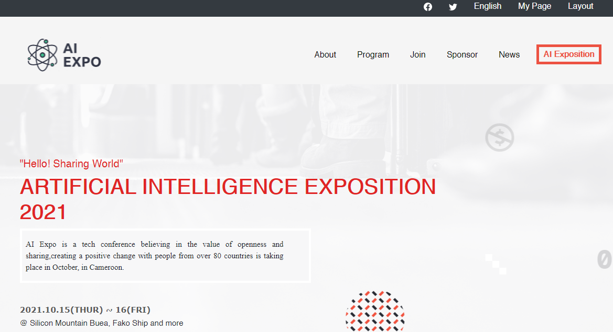
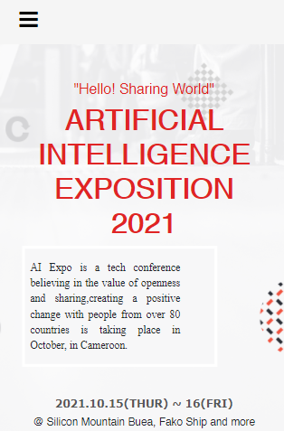

# Artifial Intelligence Summit 2021

## Screenshot

# Additional description about the project and its features.

This is my first capstone project in the Microverse of Module 1 in which I built Artificial Intelligence Global Summit 2021 . This is my responsive desktop version and mobile version conference site. The objective was to build a website by sticking with some design criteria. For that I created first-capstone-repo and cloned into my local machine. For best practices I have implemented Linter,Github Flow and professional documentation as much as I can. For the reference, you can click here to look at the design that i sticked on.

## Built With

- HTML, CSS(media queries used)
- .Stylelintrc
- .Hintrc
- .eslintrc.json

## Live Demo

[Live Demo Link](http://darrenodi.me/)

## Getting Started

To get a local copy up and running follow these simple example steps.
1. First, Fork the repository then Clone it to your machine using the git clone command
2. Install dependencies such as npm
3. Make sure you have a code editor such as vscode or sublime text
4. Once you're done cloning, you can use the ls command to view repo.
5. You can now run this project locally

### Prerequisites

1. You would need a code editor such as vs code for this project
2. A command line interface such as git bash is recommended 

## Authors

👤 **Author 1**

- GitHub: [@githubhandle](https://github.com/darrenodi)
- Twitter: [@twitterhandle](https://twitter.com/darrenodi)
- LinkedIn: [LinkedIn](https://www.linkedin.com/in/darren-odi-404ba31b2/)

## 🤝 Contributing

👤 **Contributor 1**

Contributions, issues, and feature requests are welcome!

## Show your support

Give a ⭐️ if you like this project!

## Acknowledgments

- Hat tip to anyone whose code was used
- Inspiration
- etc

## 📝 License

<<<<<<< HEAD
This project is [MIT](./MIT.md) licensed..
=======
This project is [MIT](./MIT.md) licensed.
>>>>>>> 97e487e6756bf5129f691a0b4747c814133e5044
